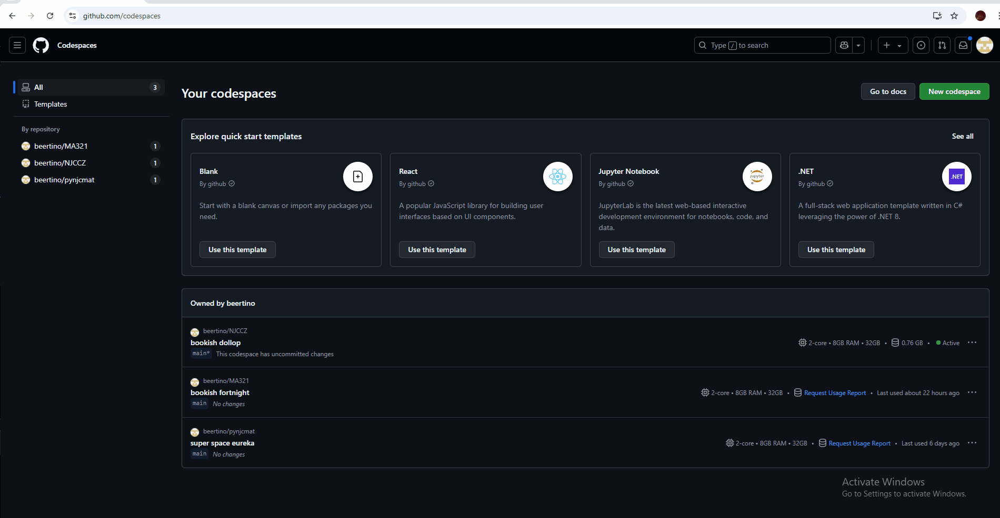
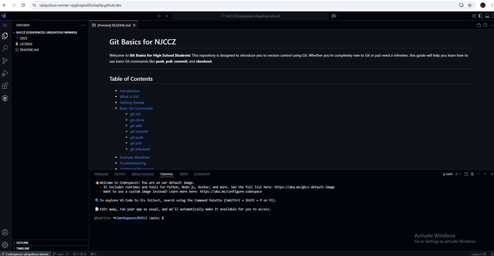
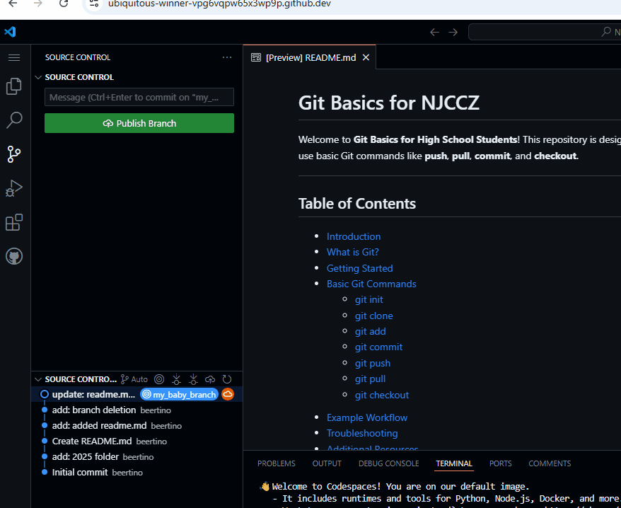
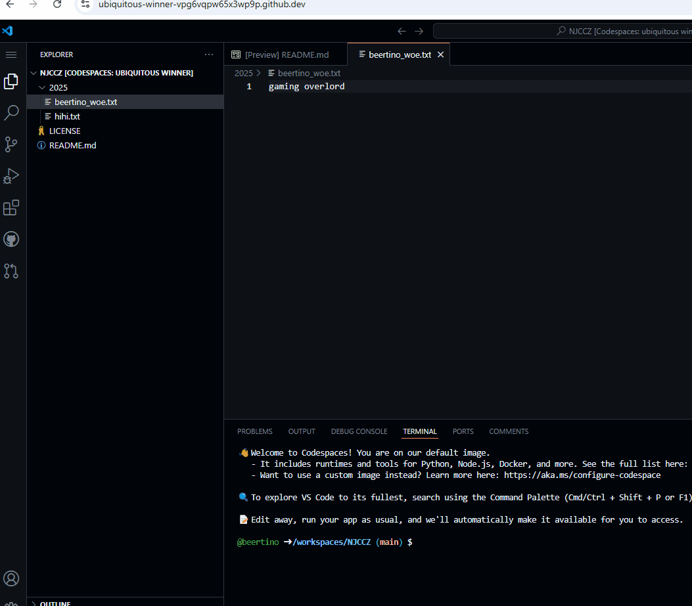

# Codespaces Basics for NJCCZ Students

Welcome to **NJC Basics for NJCCZ Students**! This repository is designed to introduce you to use Github's Codespaces to share and store your files in repos and do some version control using Git. 

---

## Table of Contents

- [Creating a Codespace on the Repo](#creating-a-codespace-on-the-repo)
- [Creating a Branch](#creating-a-branch)
- [Making Changes In a Branch](#making-changes-in-a-branch)
- [Commiting Changes](#commiting-changes)
- [Doing a Pull Request](#doing-a-pull-request)
- [Additional Resources](#additional-resources)
- [Contributing](#contributing)
- [License](#license)

---

## Creating a Codespace on the Repo
After logging in to your Github account, 
1. navigate to your [Github Codespaces](https://github.com/codespaces)
2. on the top right hand corner, click on `New codespace`
3. In the `Create new codespace` page, 
    - Under repository, look for `beertino/NJCCZ` and select it
    - you can leave the rest of the options to default
    - Click on `Create Codespace`

    

    
    

## Creating a Branch
1. On the left hand navigation panel, click on the source control icon (icon below the magnifying glass icon). In the source control pane (the bottom left panel), right click on the latest commit and choose `Create Branch`.
2. Enter a name for your branch which is a new/separate version of the main repository. Ideally, the name is short and describe the main functionality of your branch

## Making Changes In a Branch
Now that you are in a branch, you can make changes to your copy of the repository without changing anything in the main repository.
1. On the left hand navigation panel, click on the papers icon ( the top one) to go back to the repository folders.
2. For the purpose of this exercise, go under `2025` folder and create a `.txt` file there
3. Name the text file with your name and write down a hobby in the file.

## Commiting Changes
1. Go back to the source control panel.
2. Enter the message in the textbox describing the changes made, e.g. `added my_name.txt`
3. Click on `Commit`
4. Choose `Yes` when prompted about staging all the changes.
5. Click on `Publish Branch`
6. If there's a notification to run `git fetch` periodically, choose `Yes`.

"Git commit" is a command that essentially takes a snapshot of the currently staged changes in your project, saving them as a permanent part of your repository history, effectively acting like a "save point" where you can track changes made to your code over time; it records who made the changes, when they were made, and includes a descriptive message about what was modified. 

In Git, "publishing a branch" means to send a local branch you created on your computer to a remote repository like GitHub, making it accessible to other team members so they can see, collaborate on, and review your work; essentially, it's the act of sharing your branch with others on the project. 

## Doing a Pull Request
1. Click on the pull request icon, the one below Github icon
2. Choose the correct base, in this case `beertino/main` and the branch to merge, in this case should be sth of the form `<your_github_name>/<your_branch_name>`
3. Add some textual description in the box
4. Click `Create`
5. Now, you wait until the request is approved or rejected.

A pull request is a proposal to merge a set of changes from one branch into another. In a pull request, collaborators can review and discuss the proposed set of changes before they integrate the changes into the main codebase.

## Additional Resources
- [Git Official Documentation](https://git-scm.com/doc)
- [GitHub Guides](https://guides.github.com/)
- [Learn Git Branching](https://learngitbranching.js.org/)

Happy coding and enjoy using Codespaces and Git!